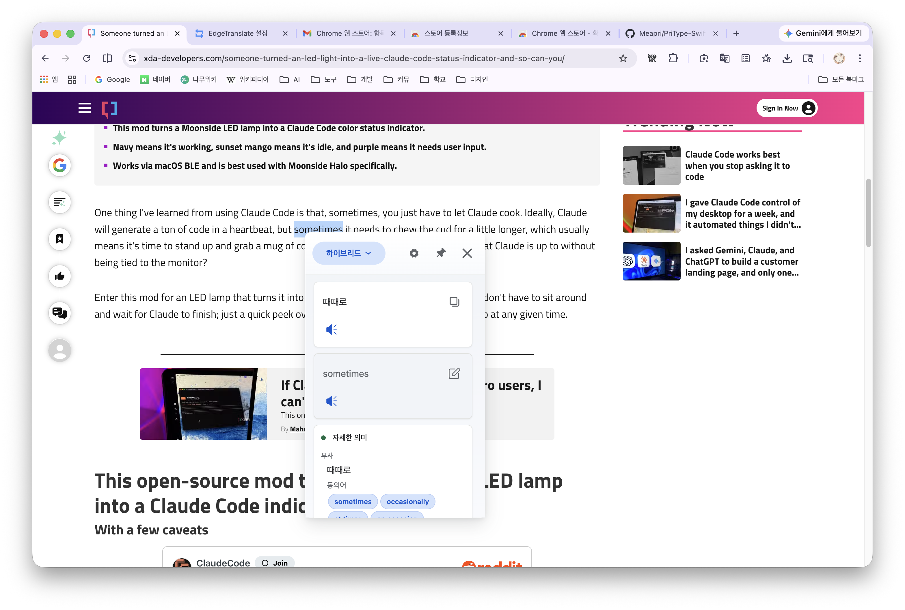
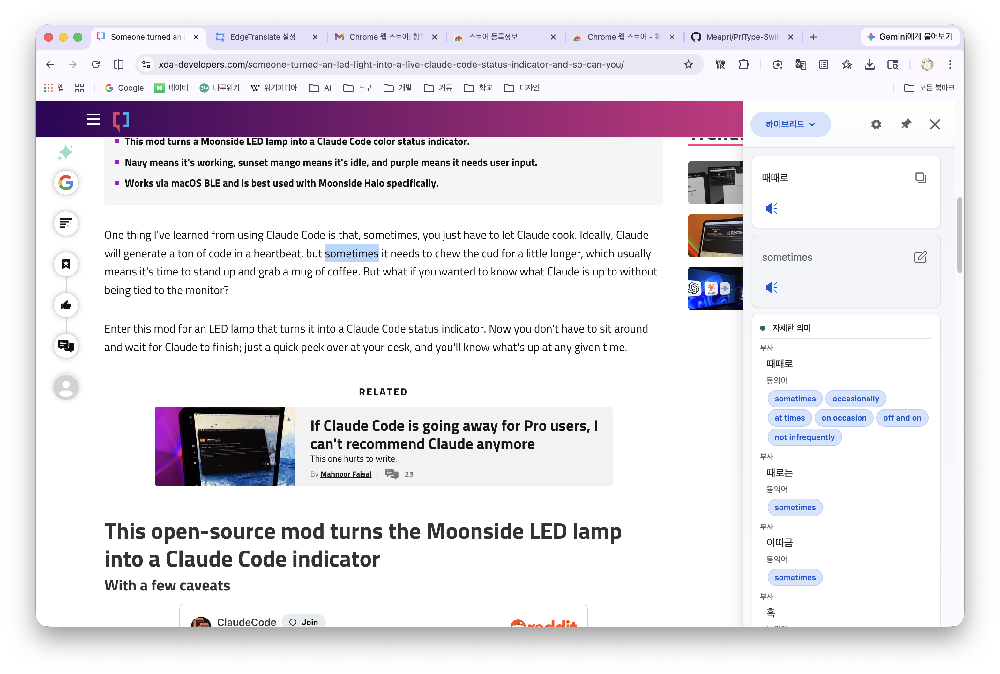
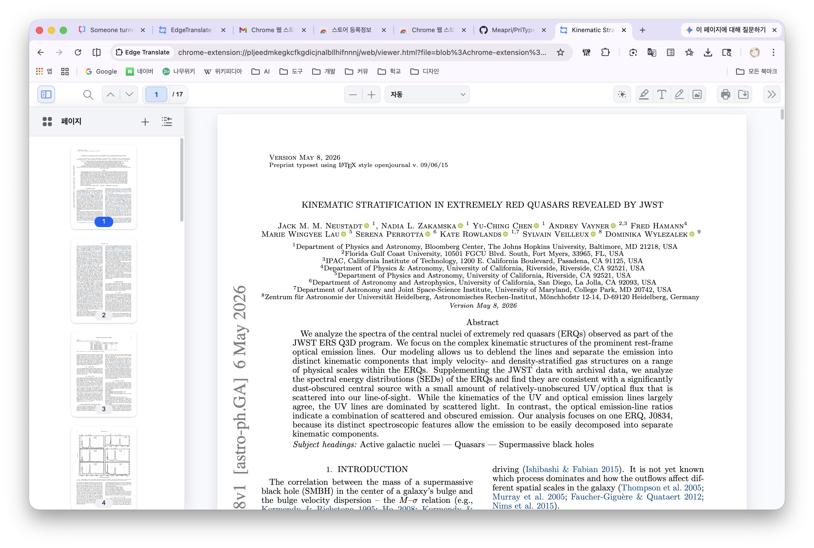
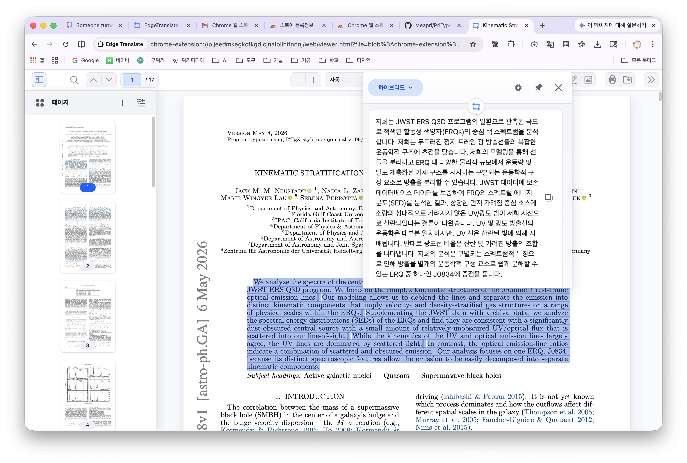

# EdgeTranslate-v3

EdgeTranslate-v3 is a Manifest V3 browser translation extension based on the original
[Edge Translate](https://github.com/EdgeTranslate/EdgeTranslate) project. This fork keeps
the familiar selection-translation workflow while modernizing the extension for current
Chrome, Firefox, and Safari policies.

The 4.x line focuses on a refreshed Material-inspired UI, a heavily updated pdf.js viewer,
dark mode, better translation panel ergonomics, and experimental Chrome on-device AI
translation through Gemini Nano where the browser supports it.

- Current repository: [Meapri/EdgeTranslate-v3](https://github.com/Meapri/EdgeTranslate-v3)
- Original project: [EdgeTranslate/EdgeTranslate](https://github.com/EdgeTranslate/EdgeTranslate)
- Latest release: [v4.0.1](https://github.com/Meapri/EdgeTranslate-v3/releases/tag/v4.0.1)

## Other Languages

- [简体中文](./docs/README_CN.md)
- [繁體中文](./docs/README_TW.md)
- [日本語](./docs/README_JA.md)
- [한국어](./docs/README_KO.md)
- [Русский](./docs/README_RU.md)

## Highlights

- Selection translation in a side panel with copy, edit, pin, resize, and TTS actions.
- Word assistance with translation, detailed meanings, definitions, and examples when the
  selected provider supports them.
- Chrome built-in AI translation support for regular text and word translation flows.
- Google and other practical engines remain available for full-page translation.
- Built-in pdf.js viewer with selection translation inside PDFs.
- Material-inspired PDF toolbar, menus, dialogs, page sidebar, and dark mode.
- Dark mode support across the PDF viewer, translation panel, popup, and settings page.
- Settings page cleanup with clearer provider names and less visual clutter.
- Keyboard shortcuts, blacklist controls, and configurable translation button behavior.

## Screenshots

### Selection Translation





### PDF Translation





## AI Translation Notes

Chrome's on-device Gemini Nano path is exposed as an AI translation provider where the
browser makes the `LanguageModel` API available. It is useful for smaller selections and
word-assistance tasks, but it is not used as a full-page translation engine in this fork.

Important behavior:

- Gemini Nano page translation was removed from the user-facing page translation options
  because current on-device performance is not practical for full pages.
- Regular AI translation is concurrency-limited to keep responsiveness reasonable without
  making CPU temperature worse than necessary.
- Prompt output is parsed defensively so malformed JSON does not leak into the translation
  panel.
- Common untranslated fragments from the AI model are cleaned up without running a slow
  second model pass.
- Visible pronunciation text was removed from result cards; TTS playback remains.

Chrome's `LanguageModel` API and Gemini Nano availability depend on the user's Chrome
version, device, feature flags, and model download state. When unavailable, the extension
falls back to the configured provider path rather than treating AI translation as a required
runtime dependency.

## PDF Viewer

EdgeTranslate-v3 opens supported PDF links in its bundled pdf.js viewer so text selection
and translation work inside documents. The 4.x viewer uses pdf.js `5.7.284` and includes
many layout and interaction fixes.

PDF behavior:

- Web PDF links can be redirected into the extension viewer for translation.
- Local PDFs can be opened when Chrome's "Allow access to file URLs" setting is enabled for
  the extension.
- Dragged PDF files and blob-backed viewer URLs are preloaded or repaired so pdf.js can load
  them reliably.
- The viewer includes a native-viewer bypass action for users who want to open the current
  document outside EdgeTranslate.
- The PDF detection fallback avoids probing unrelated non-PDF pages, preventing noisy CORS
  errors on pages such as Chrome Web Store developer console URLs.

## Browser Support

### Chrome

- Selection translation
- PDF viewer and PDF selection translation
- Google full-page translation
- Chrome built-in AI translation when the browser/device supports it
- Offscreen document support for extension-context AI translation

### Firefox

- Selection translation
- PDF viewer and PDF selection translation with browser-specific limitations
- No Chrome built-in AI translation
- No Chrome-only full-page translation behavior

### Safari

- Selection translation and PDF viewer support through the Safari extension build path
- No Chrome built-in AI translation
- Safari release requires the Xcode project and Apple credentials

## Downloads

- [GitHub Releases](https://github.com/Meapri/EdgeTranslate-v3/releases)
- [Chrome Web Store](https://chromewebstore.google.com/detail/edge-translate/pljeedmkegkcfkgdicjnalbllhifnnnj)

Release assets usually include:

- `edge_translate_chrome.zip`
- `edge_translate_firefox.xpi`

## Development Setup

Use the repository root as the working directory.

```bash
npm ci
```

Run the unit test suite:

```bash
npm test
```

Run the EdgeTranslate workspace tests directly:

```bash
npm test -w edge_translate -- --runInBand
```

## Build Commands

Build the default Chrome target:

```bash
npm run build:chrome
```

Build individual targets:

```bash
npm run build:chrome
npm run build:firefox
npm run build:safari
```

Create browser packages:

```bash
npm run pack:chrome -w edge_translate
npm run pack:firefox -w edge_translate
```

Validate the Firefox package:

```bash
npm run lint:firefox
```

Build outputs:

- Chrome unpacked build: `packages/EdgeTranslate/build/chrome/`
- Firefox unpacked build: `packages/EdgeTranslate/build/firefox/`
- Chrome package: `packages/EdgeTranslate/build/edge_translate_chrome.zip`
- Firefox package: `packages/EdgeTranslate/build/edge_translate_firefox.xpi`
- Safari build output: `packages/EdgeTranslate/build/safari/`

## Loading Local Builds

### Chrome

1. Open `chrome://extensions`.
2. Enable Developer mode.
3. Click "Load unpacked".
4. Select `packages/EdgeTranslate/build/chrome/`.
5. Enable "Allow access to file URLs" if you want local PDF/file translation.

### Firefox

1. Open `about:debugging`.
2. Choose "This Firefox".
3. Click "Load Temporary Add-on".
4. Select any file inside `packages/EdgeTranslate/build/firefox/`, or use the generated
   `edge_translate_firefox.xpi`.

### Safari

Safari builds live under `packages/EdgeTranslate/safari-xcode/`.

Useful commands:

```bash
npm run build:safari
npm run safari:sync -w edge_translate
npm run safari:release -w edge_translate
```

`safari:release` builds, syncs resources into the Xcode project, archives, exports, and
uploads. It requires valid App Store credentials.

## Permissions

The extension uses host access so selection translation, PDF detection, and content scripts
can work on user pages. Chrome builds also request `offscreen` so Gemini Nano translation can
run from an extension document context when page injection is not available, such as inside
the extension PDF viewer.

Main permission categories:

- `activeTab`, `tabs`, and `scripting` for selection translation and page interactions.
- `contextMenus` and `storage` for commands and user settings.
- `webNavigation` and `webRequest` for PDF detection and viewer routing.
- `offscreen` on Chrome for extension-context AI translation.

## Privacy

- No analytics or telemetry collection is added by this fork.
- Translation text is sent only to the provider selected/configured by the user.
- Chrome on-device AI translation runs through Chrome's built-in local model path when
  available.
- File URL access is optional and controlled by the browser extension settings.

## Release Checklist

For a normal release:

1. Update `packages/EdgeTranslate/package.json`.
2. Update `package-lock.json`.
3. Update `packages/EdgeTranslate/src/manifest.json`.
4. Run tests and browser packaging.
5. Create a release commit and tag, for example `v4.0.1`.
6. Upload Chrome and Firefox package artifacts to GitHub Releases.

See [RELEASE_CHECKLIST.md](./RELEASE_CHECKLIST.md) for the older project checklist.

## Documentation

Legacy feature references from the original project are still useful for general behavior:

- [Instructions](./docs/wiki/en/Instructions.md)
- [Precautions](./docs/wiki/en/Precautions.md)
- [Privacy Policy](./docs/wiki/en/PrivacyPolicy.md)
- [Local LLM Translate Proxy](./docs/local-llm-translate-proxy.md)

## License

This project follows the same license structure as the original Edge Translate project.

- [LICENSE.MIT](./LICENSE.MIT)
- [LICENSE.NPL](./LICENSE.NPL)

## Credits

Thanks to the original Edge Translate maintainers and contributors. EdgeTranslate-v3 keeps
that foundation alive for Manifest V3 browsers while continuing to adapt the extension for
modern browser APIs, PDF workflows, and AI-assisted translation.
