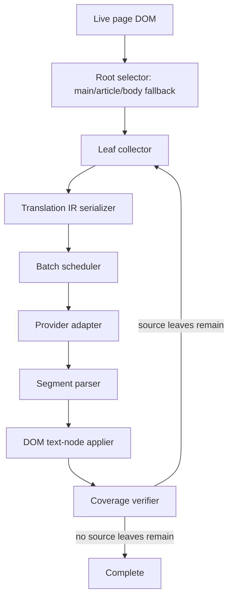

# LLM Page Translation Specification

## Purpose

This document specifies a page translation architecture optimized for LLM-era
translation engines. The goal is to improve translation coverage, naturalness,
latency, and token efficiency while preserving the live page DOM.

The core principle is:

> Let the LLM translate language. Let the extension own DOM structure, safety,
> caching, scheduling, validation, and completion.

This means the extension must not ask an LLM to regenerate a whole page or a
whole HTML subtree when the page already has a working DOM. Instead, the
extension converts page content into a compact translation intermediate
representation, sends only linguistic content plus minimal inline markers, then
applies returned text back onto the original DOM.

## Non-Goals

- Do not send whole page HTML to the model.
- Do not ask the model to preserve real `href`, `class`, `style`, `id`, or
  `data-*` attributes.
- Do not trust request completion count as page completion.
- Do not hardcode site-specific selectors for one broken page.
- Do not mutate layout structure when text-node updates are sufficient.
- Do not rely on one provider-specific structured output mode as the only path.

## Target Outcomes

- First visible translated block appears quickly.
- Page reaches actual coverage, not just `100%` request progress.
- Token cost stays proportional to visible language, not markup size.
- Links, styling, page scripts, event listeners, and layout identity survive.
- Late-loaded or hydrated content is translated after it appears.
- Repeated content is translated once per engine/model/language configuration.
- Local, cloud, and Chrome built-in translation engines share the same DOM path.

## Current Failure Mode

Observed live symptom:

- The page banner reports `Translation complete` and `100%`.
- Some article blocks remain in the source language.
- The remaining source-language blocks have no `data-edge-*` translated markers.
- This implies they were not counted as successfully translated DOM leaves.

Root cause class:

- Initial collection or later re-collection does not represent all final content
  in the page.
- Completion is derived from dispatched translation entries rather than verified
  DOM coverage.

The fix is architectural:

- Keep the LLM payload lightweight.
- Add a DOM coverage verifier before declaring completion.
- Re-collect only the untranslated leaves that remain.

## Architecture Overview



## Translation IR

The translation intermediate representation is the model-facing payload format.
It should be compact, stable, parseable, and provider-portable.

### IR Principles

- Use a stable static instruction prefix.
- Put variable page content after static instructions to improve prompt cache
  reuse on providers that support prefix caching.
- Use numeric segment IDs.
- Include role hints such as `title`, `paragraph`, `list-item`, `caption`,
  `table-cell`, or `nav` only when helpful.
- Preserve only minimal inline semantic markers.
- Keep real DOM attributes out of the prompt.
- Make output parseable even when the model ignores formal JSON mode.

### Preferred Text Protocol

Input:

```text
Translate the following page segments to Korean.
Preserve meaning, tone, numbers, dates, product names, and proper nouns.
Preserve inline markers such as <a0>...</a0> when possible.
Return only translated segments in the same [[id]] format.

Document:
source=auto
target=ko
title=KDE Plasma 6.7 is on the horizon as bug fixes make it in before release

Segments:
[[1|title]]
KDE Plasma 6.7 is on the horizon as a flurry of bug fixes make it in before release

[[2|paragraph]]
It's always a fun time keeping tabs on the development of a Linux kernel, distro, or desktop environment.

[[3|paragraph]]
Over on <a0>the official news feed</a0>, KDE announced the changes.
```

Output:

```text
[[1]]
KDE Plasma 6.7은 여러 버그 수정이 반영되며 출시를 앞두고 있습니다

[[2]]
리눅스 커널, 배포판, 데스크톱 환경의 개발 상황을 지켜보는 일은 언제나 흥미롭습니다.

[[3]]
KDE는 <a0>공식 뉴스 피드</a0>에서 변경 사항을 발표했습니다.
```

### Optional JSON Protocol

Use JSON or structured output only when the active provider reliably supports
it and the schema overhead is justified.

```json
{
  "segments": [
    { "id": 1, "text": "KDE Plasma 6.7은 여러 버그 수정이 반영되며 출시를 앞두고 있습니다" },
    { "id": 2, "text": "리눅스 커널, 배포판, 데스크톱 환경의 개발 상황을 지켜보는 일은 언제나 흥미롭습니다." }
  ]
}
```

JSON is useful for strict providers but can cost more tokens than marker text.
The marker protocol must remain the baseline fallback for OpenAI-compatible and
local model servers.

## DOM Collection

### Root Selection

Root selection should prefer content roots over the whole body:

1. PDF viewer text layer root when translating PDFs.
2. A single dominant `main` or `[role="main"]` when it holds substantial text.
3. A dominant `article` when no good `main` exists.
4. `document.body` fallback for small or unusual pages.

Additional headings outside the root may be included when they are likely the
article title.

### Leaf Block Collection

Collect leaf blocks, not arbitrary text nodes. Candidate tags:

- `h1` to `h6`
- `p`
- `li`
- `blockquote`
- `figcaption`
- `caption`
- `summary`
- `dd`, `dt`
- `th`, `td`
- `label` only when it is content-like, not a form control label

Skip:

- `script`, `style`, `noscript`, `template`
- `svg`, `math`
- `code`, `pre`, `kbd`, `samp`
- `input`, `textarea`, `select`, `option`
- global `header`, `footer`, `nav`, `[role="banner"]`,
  `[role="contentinfo"]`, `[role="search"]`
- login, newsletter, follow, modal, popup, ad, sponsor, promo surfaces
- extension-owned UI
- hidden or aria-hidden subtrees

### Eligibility

A leaf is eligible when:

- It is connected.
- It has meaningful language text.
- It is inside a translation root.
- It is not already translated in the current session.
- It is not pending.
- It is not known failed beyond retry budget.
- It is not already mostly in the target script.

For Korean target, Hangul-script ratio should be used as a cheap skip signal,
but Latin terms inside a Korean sentence must not block completion.

## Serialization

### Inline Marker Strategy

The serializer should preserve inline semantics without real attributes.

Original:

```html
Over on the <a href="https://kde.org" class="link">official news feed</a>, KDE announced it.
```

Serialized:

```text
Over on the <a0>official news feed</a0>, KDE announced it.
```

Apply stage maps `<a0>` back onto the original anchor by position. The model
never sees or controls the real URL.

Allowed inline markers:

- `aN`
- `strongN`
- `emN`
- `codeN` only when code text should be preserved, not translated
- `br` as a line-break marker when the block has meaningful visual lines

Unknown inline tags should be flattened to text unless the product explicitly
needs them.

### Attribute Policy

Never send these to the LLM:

- `href`
- `src`
- `srcset`
- `id`
- `class`
- `style`
- `data-*`
- `aria-*`
- event handlers

The applier keeps original DOM nodes and attributes, so there is nothing for the
model to restore.

## Batching

### Goals

- Preserve enough context for natural translation.
- Avoid large output payloads.
- Prioritize the visible viewport.
- Minimize the number of round trips.
- Keep provider-specific limits respected.

### Batch Shape

A batch is a list of leaf segments plus optional local context:

- Page title.
- Section heading.
- Nearby preceding heading.
- Short content category hint.

Do not include unrelated page text merely to provide context.

### Recommended Defaults

Cloud LLM:

- Lead batch: 1 to 4 visible leaf blocks, up to about 2,000 source chars.
- Normal batch: 8 to 32 leaf blocks, capped by estimated input/output tokens.
- Concurrency: provider-adaptive, with backoff on rate limit or slow queue.

OpenAI-compatible local LLM:

- Lead batch: 1 to 2 visible leaf blocks, up to about 800 source chars.
- Normal batch: 2 to 8 leaf blocks, capped by local context.
- Concurrency: no higher than local server parallel slots.

Chrome built-in:

- Prefer small batches.
- Treat as low-cost but latency-sensitive.
- Do not assume it benefits from large context.

## Provider Adapters

### OpenAI

- Keep static system prompt and schema at the start.
- Put variable segments at the end.
- Use `prompt_cache_key` when available and stable by domain/profile.
- Use structured output only if the model supports it and latency is acceptable.
- Marker protocol remains valid for all supported models.

### Gemini API

- Use structured output when the selected model supports it and schema remains
  small.
- Consider explicit caching only for large stable prompt/context prefixes.
- Prefer marker protocol when schema overhead reduces throughput.

### OpenAI-Compatible / Local

- Prefer marker protocol.
- Avoid strict JSON unless the server/model has proven reliable.
- Keep prompts short.
- Use smaller batches and retries for dropped markers.

### Chrome Built-In

- Use the built-in Translator API for direct text translation when available.
- Use Prompt API only for model behavior that needs instruction following.
- Expect smaller local context and session lifecycle constraints.

## Current Code Inventory

The current implementation already has a DOM page translation path. The new IR
architecture should reuse its good pieces and replace only the unsafe or
ambiguous parts.

Primary files:

- `packages/EdgeTranslate/src/content/dom_page_translate_context.js`
  - currently owns role inference, context groups, HTML section collection,
    segmented marker helpers, same-language detection, HTML sanitization, and
    section apply helpers.
  - this is the right home for provider-neutral IR collection, serialization,
    parsing, and DOM apply primitives.
- `packages/EdgeTranslate/src/content/banner_controller.js`
  - currently owns page translation lifecycle, root selection, batching,
    provider dispatch, progress, mutation scans, coverage scans, cache, and
    banner state.
  - this file should orchestrate IR modules but should not contain most IR
    parsing or DOM tree surgery.
- `packages/EdgeTranslate/src/background/library/pageTranslate.js`
  - currently dispatches page translation commands into the content side.
  - this should remain mostly unchanged unless the public command payload needs
    new feature flags or debug options.
- `packages/EdgeTranslate/test/unit/content/domPageTranslateContext.test.js`
  - best target for collector, serializer, parser, and applier unit tests.
- `packages/EdgeTranslate/test/unit/content/bannerController.test.js`
  - best target for lifecycle, coverage, batching, retry, cache, and progress
    tests.

Existing behavior to migrate away from:

- The AI path can send translated leaf or section `innerHTML` and ask the model
  to preserve tags and attributes.
- Completion can still be reasoned about through translated-entry counts before
  a stable DOM coverage pass proves that no meaningful source leaves remain.
- Coverage sweep exists as a safety net, but it is bolted onto a section/HTML
  ownership model rather than being the primary completion contract.

Existing behavior to keep:

- Root narrowing to dominant `main` plus outside article headings.
- Mutation and incremental scan scheduling.
- Same-language skip heuristics.
- Original-text hover registration.
- Session translation cache.
- Bounded retry and circuit-breaker style convergence.
- Debug event buffering behind explicit debug mode.

## Migration Contract

The migration should be incremental. Do not replace the whole page translation
stack in one patch.

### Step A: Add IR Primitives Beside Current HTML Primitives

Add provider-neutral functions to `dom_page_translate_context.js`:

- `collectTranslationLeaves(roots, options)`
- `serializeTranslationLeaf(leaf, options)`
- `buildTranslationIrBatch(leaves, options)`
- `parseTranslationIrReply(text, expectedIds, options)`
- `applyTranslationIrSegment(segment, translatedText, options)`
- `findRemainingSourceLeaves(roots, options)`

The first version can internally reuse existing helpers such as
`inferDomPageTextRole`, `isAlreadyInTargetLanguage`,
`splitLeafByLineBreaks`, and marker parsing patterns.

### Step B: Dual-Run Collection In Tests

Before switching runtime dispatch, add tests proving:

- current roots plus IR leaf collection include article paragraphs, headings,
  lists, and captions from real-world structures.
- global nav, footer, ad, newsletter, and code/pre blocks stay out.
- already-target Korean blocks are skipped without blocking completion.
- an untranslated leaf inside a section marked translated is still returned by
  `findRemainingSourceLeaves`.

### Step C: Route One AI Engine Through IR

Switch the lowest-risk AI page translation engine first, preferably the
OpenAI-compatible/local path or a debug feature flag.

Runtime guard:

```js
const useIrPageTranslation =
  this._domPageTranslateOptions?.irMode === true ||
  this.isOpenAiCompatibleDomPageEngine(engine);
```

The exact guard can change, but the first runtime switch should be narrow and
reversible.

### Step D: Make Completion Coverage-First

Replace completion checks that only compare total and completed entries with a
coverage-aware state:

```js
isDomPageCoverageComplete() =
  totalEntries > 0 &&
  queueEmpty &&
  activeTranslations === 0 &&
  pendingApplyCount === 0 &&
  stableCoveragePassCount >= 1 &&
  remainingSourceLeaves.length === 0
```

The banner can still show request progress, but `Translation complete` must wait
for coverage completion.

### Step E: Retire HTML-Controlled Model Output

Once IR is stable across local and cloud providers:

- stop sending real `innerHTML` to LLMs by default.
- keep HTML apply helpers only as legacy fallback or remove them if tests prove
  IR fully covers the supported cases.
- update tests that expect `htmlMode` to expect inline marker preservation
  instead.

## Parsing And Applying

### Parser Requirements

- Parse all valid returned segment IDs.
- Ignore unknown IDs.
- Drop duplicate IDs after the first valid content.
- Treat missing IDs as partial success, not total failure.
- Strip prompt echo before validation.
- Detect source echo and avoid caching it.

### DOM Apply Rules

- Mutate text nodes only when possible.
- Preserve original element identity.
- Preserve original attributes and event listeners.
- Never swap a live page subtree with model-generated HTML.
- For inline marker mismatch, flatten translated text into the leaf as a safe
  fallback rather than leaving the whole block untranslated.
- Register original text for hover/original tooltip before mutation.

### Cache Rules

Segment cache key:

```text
engine|model|sourceLang|targetLang|hash(serializedLeaf)
```

Cache only successful translations.

Do not cache:

- Empty translations.
- Source echoes.
- Prompt echoes.
- Suspiciously long hallucinated output.
- Output with unresolved dangerous markup.

Persistent cache should be opportunistic. It must never block live translation.

## Completion And Coverage

Completion must be based on DOM state, not only request state.

### Completion Preconditions

Only show `Translation complete` when all are true:

- Queue is empty.
- Active translation count is zero.
- No pending apply work remains.
- Coverage verifier finds no meaningful source-language leaf in roots.
- Coverage verifier has run at least one stable pass after the last mutation.

### Coverage Verifier

The coverage verifier walks roots and collects still-source-looking leaves.

Pseudo-code:

```js
function findRemainingSourceLeaves(roots, targetLang) {
  const leaves = collectTranslatableLeaves(roots, {
    includeAlreadyMarked: true,
    ignorePending: true,
  });

  return leaves.filter((leaf) => {
    if (!hasMeaningfulText(leaf)) return false;
    if (isAlreadyInTargetLanguage(leaf.textContent, targetLang)) return false;
    if (isLowValueText(leaf.textContent)) return false;
    return true;
  });
}
```

If remaining leaves exist:

1. Unmark only those leaves or their nearest translated section owner.
2. Requeue only the remaining leaves.
3. Increment a bounded coverage retry counter.
4. Keep banner state as running, not complete.

### Bounded Retry

Use separate budgets:

- Per segment: 2 partial marker retries.
- Per leaf: 2 coverage retries.
- Per page: 5 coverage scans before giving up.

If a leaf still cannot be translated, mark it as exhausted and log a diagnostic
event so completion can converge.

## Observability

Debug events should answer:

- What roots were selected?
- How many leaves were collected?
- How many leaves were skipped, and why?
- How many segments were sent?
- Which provider handled the batch?
- Which segments applied?
- Which segments were missing?
- Which leaves remained at coverage pass?
- Why did the page finally complete or give up?

Recommended debug events:

- `llm-ir:roots`
- `llm-ir:collect`
- `llm-ir:serialize`
- `llm-ir:batch`
- `llm-ir:request`
- `llm-ir:response`
- `llm-ir:parse`
- `llm-ir:apply`
- `coverage:scan`
- `coverage:requeue`
- `coverage:complete`
- `coverage:exhausted`

Mirror recent debug events into a JSON script node only when debug mode is on.

## Implementation Plan

### Phase 1: Spec And Test Harness

- Add this specification.
- Add fixtures for real-world page structures:
  - article with hero title outside `main`
  - hydrated/lazy article body
  - inline links and emphasis
  - list-heavy summary section
  - ad/sidebar/footer noise
  - mixed Korean plus English proper nouns
- Add unit tests for collector, serializer, parser, apply, and coverage.

Exit criteria:

- Tests prove the collector includes the XDA-style body paragraphs that were
  previously left untranslated.
- Tests prove completion is blocked when source-language leaves remain.

Suggested test additions:

- `domPageTranslateContext.test.js`
  - `collectTranslationLeaves collects article leaves under dominant main`
  - `collectTranslationLeaves includes h1 outside main when provided as root`
  - `serializeTranslationLeaf replaces anchors with stable inline markers`
  - `parseTranslationIrReply accepts partial valid ids and reports missing ids`
  - `applyTranslationIrSegment preserves original href and attributes`
  - `findRemainingSourceLeaves returns untranslated leaves inside marked sections`
- `bannerController.test.js`
  - `does not report complete until coverage pass is stable`
  - `requeues only remaining untranslated leaves after coverage scan`
  - `does not cache source echo from IR response`
  - `keeps exhausted leaves bounded and logs coverage:exhausted`

### Phase 2: Translation IR Module

Create a dedicated module near `dom_page_translate_context.js` or split the
current file:

- `collectTranslationLeaves`
- `serializeTranslationLeaf`
- `buildTranslationIrBatch`
- `parseTranslationIrReply`
- `applyTranslationIrSegment`
- `findRemainingSourceLeaves`

Exit criteria:

- Existing page translation tests still pass.
- New IR tests pass.
- No provider-specific code leaks into collection/apply logic.

Implementation notes:

- Keep exported function names small and explicit.
- Keep DOM mutation inside apply functions, not provider adapters.
- Return structured diagnostics from parser and coverage functions instead of
  forcing callers to infer from booleans.
- Use existing same-language heuristics first, then refine only when tests show
  false positives or false negatives.

### Phase 3: BannerController Integration

- Replace scattered section/segment preparation with IR batch creation.
- Keep current per-string cache behavior.
- Update progress calculation to distinguish:
  - dispatched entries
  - applied segments
  - remaining coverage leaves
  - exhausted leaves
- Prevent `Translation complete` until coverage verifier passes.

Exit criteria:

- Banner no longer reports complete while source leaves remain.
- Coverage pass requeues only remaining untranslated leaves.

Runtime state to track:

- `queuedBatches`
- `activeBatches`
- `appliedSegments`
- `missingSegments`
- `remainingCoverageLeaves`
- `exhaustedCoverageLeaves`
- `stableCoveragePasses`

Banner wording:

- Running: show translated/applied progress.
- Verifying: show coverage verification after request queue drains.
- Complete: only after stable coverage pass.
- Complete with exceptions: optional, only when exhausted leaves remain and the
  user needs an honest terminal state.

### Phase 4: Provider-Specific Optimization

- OpenAI:
  - stable static prefix
  - optional structured output
  - prompt cache key when supported
- Gemini:
  - structured output only for supported models and simple schema
  - marker fallback
- OpenAI-compatible:
  - marker protocol only by default
  - smaller adaptive batches
- Chrome built-in:
  - small segment batches
  - no large context assumptions

Exit criteria:

- Provider adapters share one IR contract.
- Failures fall back without breaking DOM coverage.

### Phase 5: Live Browser Verification

Use the actual loaded Chrome extension build and live pages.

Required checks:

- XDA article that previously showed 100% with English body blocks.
- A long article with lazy-loaded content.
- A page with many inline links.
- A page with code blocks that must not translate code.
- A PDF viewer page, if page translation is enabled there.

Metrics:

- Time to first translated visible block.
- Time to actual complete.
- Input tokens.
- Output tokens.
- Cache hit count.
- Coverage requeue count.
- Remaining source-language leaf count.

Exit criteria:

- Live page reaches actual coverage or logs bounded exhausted leaves.
- No layout break from model output.
- Token usage does not regress versus current marker-based path on the same
  sample pages.

## Benchmark Matrix

Run each benchmark with the same source/target language pair and the same model
configuration.

| Scenario | Expected result | Metrics |
| --- | --- | --- |
| Long article with dominant `main` | body paragraphs and outside title translate | first block latency, complete latency, remaining leaves |
| Lazy-loaded article body | late paragraphs translate after mutation scan | incremental scan count, coverage requeue count |
| Link-heavy article | links keep href/target/class; only text changes | marker mismatch count, layout regressions |
| Code-heavy technical article | code/pre/kbd/samp are preserved | skipped code blocks, false translation count |
| Mixed Korean and English names | Korean sentences are skipped; names remain natural | target-script false positives |
| Local OpenAI-compatible model | small batches converge without dropped markers | retry count, missing id count |
| Gemini cloud | structured or marker mode stays parseable | schema overhead, parse failure count |
| Chrome built-in | direct text translation path stays fast | session creation latency, batch latency |

Minimum metrics to log per page:

- selected root count
- collected leaf count
- skipped leaf count by reason
- input character count
- estimated input/output tokens when provider exposes them
- request count
- parse failure count
- missing segment count
- applied segment count
- coverage scan count
- coverage requeue count
- exhausted leaf count
- final visible source-language leaf count

## Risk Register

| Risk | Cause | Mitigation |
| --- | --- | --- |
| False complete | completion tied to requests, not DOM state | coverage-first complete contract |
| Token regression | over-large context or JSON schema overhead | marker protocol baseline and provider caps |
| Link loss | model controls HTML | inline marker mapping back to original DOM nodes |
| Layout break | subtree replacement | text-node mutation first, element identity preserved |
| Dropped markers | batch too large or weak model | adaptive batch shrink and partial success parsing |
| Re-translation loop | dynamic pages mutate constantly | coalesced scans, stable pass requirement, bounded retry |
| Target-language false skip | script heuristic too broad | role-aware and length-aware skip tests |
| Provider lock-in | relying on one structured output feature | marker protocol required for every provider |
| Debug noise | always-on logs or script mirrors | debug-only event buffer |

## Definition Of Done

The implementation is done when all are true:

- The LLM never receives full page HTML or real DOM attributes in default AI
  page translation mode.
- Every translated segment has a stable ID from collection through apply.
- A translated page cannot enter `Translation complete` until a stable coverage
  pass finds no eligible source-language leaves.
- The observed live failure class is covered by a unit test and a live browser
  verification note.
- Local, cloud, and Chrome built-in engines either use the IR path or explicitly
  document why they are still on a legacy fallback.
- Debug logs can reconstruct root selection, collection, batching, response
  parsing, apply, coverage requeue, and final completion.

## Acceptance Criteria

- `Translation complete` means no eligible source-language leaves remain.
- Source-language leftovers trigger coverage requeue automatically.
- Whole-page HTML is never sent to the LLM.
- Real DOM attributes are never model-controlled.
- Repeated strings hit session or persistent cache.
- Output parsing tolerates partial marker loss.
- Local and cloud providers use the same apply pipeline.
- Unit tests cover the observed live failure mode.
- Live Chrome verification confirms the extension build path actually loaded.

## Open Decisions

- Whether to use JSON structured output by default for OpenAI cloud models.
- Whether Gemini structured output gives enough reliability to justify schema
  overhead for page translation.
- How aggressive the final coverage language heuristic should be for Latin
  names inside Korean text.
- Whether exhausted untranslated leaves should be shown in the banner as
  `Translated with exceptions`.
- Whether persistent cache should be scoped by domain or full URL for article
  body text.

## Recommended Next Step

Implement Phase 1 and Phase 2 first. The main risk is not provider prompting,
but ambiguous ownership between collection, pending/translated marking, and
completion. Once IR and coverage are separately testable, provider optimization
becomes much safer.

When implementation starts, use this order:

1. Add IR primitive tests in `domPageTranslateContext.test.js`.
2. Implement only enough `dom_page_translate_context.js` exports to satisfy
   those tests.
3. Add BannerController coverage-completion tests.
4. Integrate IR behind a narrow runtime guard.
5. Run focused unit tests:

```sh
npm test -- domPageTranslateContext
npm test -- bannerController
```

Run these from `packages/EdgeTranslate`.
